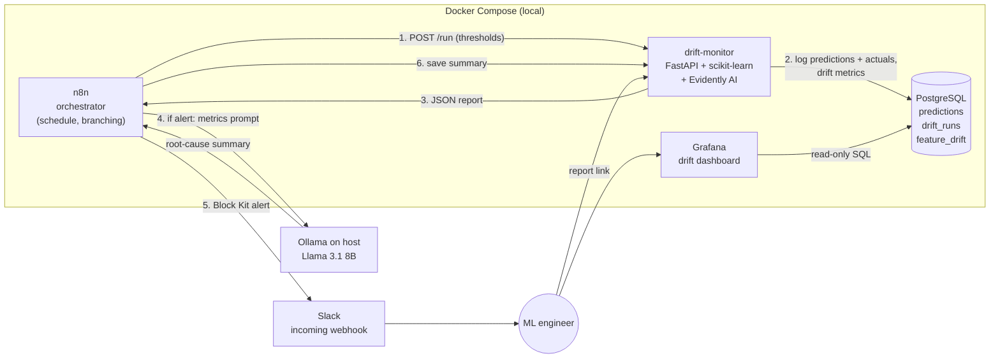

# Architecture: Model Monitoring + Drift Alert Agent

## The problem

A model that scored 96% on its test set can quietly get worse in production. Input data shifts (new
equipment, a new customer mix, a broken upstream pipeline), and nobody notices until the business does.
The labels that would show the drop often arrive late, so teams need **leading indicators** (drift in the
inputs and outputs) plus **fast triage**: an alert that says *what* changed and *why it probably happened*,
not just "PSI = 2.4".

## The solution

An automated monitoring agent, built only from free and open-source tools and running locally in Docker:

1. **Logs** every prediction and its eventual ground truth to PostgreSQL.
2. **Measures** data drift, prediction drift, target drift, data quality and model performance against a
   frozen reference set, using Evidently AI.
3. **Decides** whether to alert, using configurable thresholds.
4. **Explains** the likely root cause in plain English with a local LLM (Llama 3.1 via Ollama). No
   monitoring data leaves the machine.
5. **Notifies** Slack with the explanation, the numbers and links to the full report and the dashboard.
6. **Visualises** drift over time in Grafana, including every past alert and its explanation.

## Architecture

## Data flow (one monitoring cycle)

| # | Step | Where | Detail |
|---|---|---|---|
| 1 | Trigger | n8n Schedule node | Every 15 min, or manually. The **Config** node holds the thresholds. |
| 2 | Traffic | `simulate.py` | 400 rows of "production" requests, optionally with an injected drift pattern. |
| 3 | Score | `pipeline.py` | The frozen RandomForest pipeline predicts P(malignant) and the label. |
| 4 | Log | `db.py` → `predictions` | Features (JSONB), prediction, probability, actual, model version, timestamp. |
| 5 | Analyse | `drift.py` (Evidently) | Current batch vs. the 228-row reference set: per-feature tests, PSI, KL, dataset share, prediction/target drift, quality metrics. |
| 6 | Report | `/reports/{run}.html` + JSON | Interactive Evidently report (drift, classification quality, data summary). |
| 7 | Decide | `evaluate_alert()` | Rules → `triggered`, `severity` (ok / warning / critical), human-readable `reasons`. |
| 8 | Explain | n8n Code → Ollama `/api/chat` | Prompt built from the metrics only. The simulated scenario is withheld, so the LLM must infer the cause. |
| 9 | Notify | n8n HTTP → Slack | Severity, KPIs, reasons, LLM analysis, top features, report and Grafana buttons. |
| 10 | Audit | `POST /runs/{id}/summary` | The explanation, model name and Slack delivery status are written back to `drift_runs`. |
| — | Failure path | n8n error output | If the monitor is down, Slack gets a "pipeline failed" alert instead of silence. |

## Metrics tracked

| Category | Metric | Method | Default alert rule |
|---|---|---|---|
| Data drift (per feature) | Distribution test | Evidently default: Kolmogorov–Smirnov (p < 0.05) | — |
| | Population Stability Index | Evidently `psi` | any feature ≥ **0.25** |
| | KL divergence | Evidently `kl_div` | reported |
| | Mean shift % | reference vs. current mean | reported |
| Data drift (dataset) | Share of drifted features | Evidently `DriftedColumnsCount` | ≥ **30%** |
| Prediction drift | PSI of P(malignant); predicted-positive rate | Evidently `psi` | ≥ **0.20** |
| Target drift | Actual malignant rate | Evidently Z-test | p < **0.05** |
| Model quality | Accuracy, precision, recall, F1, ROC AUC (reference vs. current) | scikit-learn | accuracy drop ≥ **5 pts** or recall drop ≥ **10 pts** → critical |
| Data quality | Missing-value share per feature | pandas | ≥ **5%** → critical |

All thresholds can be changed in the n8n **Config** node without touching code.

## What the test runs showed

| Injected scenario | Evidently signal | Model impact | Alert |
|---|---|---|---|
| Healthy traffic | 0% features drifted, max PSI ≈ 0.05 | accuracy ≈ 96% | none |
| Imaging recalibration (full) | 8 features with PSI > 0.25 (texture, radius, area), prediction PSI ≈ 0.85 | accuracy 96.5% → ~80%, precision 0.99 → 0.69 | **critical** |
| Patient-population shift | 87–90% of features drifted, malignant rate 37% → 82% | accuracy ~93% (model still valid) | warning |
| Pipeline bug | 1 feature with PSI ≈ 3.8 (`mean_area` ÷100), 35% nulls | accuracy unchanged (imputation masks it) | **critical** |

These runs show two things. **Drift doesn't always mean degradation:** the population shift moved almost
everything, yet the model stayed accurate. And **degradation can hide behind small drift counts:** the
calibration issue moved only about a quarter of the features but cost 15 accuracy points. That's why the
agent looks at drift, quality and data-quality signals together.

## Tech stack and why

| Component | Tool | Why |
|---|---|---|
| Model | scikit-learn RandomForest on UCI Breast Cancer Wisconsin | Bundled with scikit-learn: the build works offline and is reproducible. Trained at image build time to give a frozen baseline. |
| Drift detection | **Evidently AI 0.7** | Standard open-source drift library. Statistical tests + PSI/KL + HTML reports. |
| Service | FastAPI + Uvicorn | Thin HTTP layer so any orchestrator (n8n, Airflow, cron) can trigger runs. |
| Storage | **PostgreSQL 17** | Prediction log + drift history. Separate databases and least-privilege roles for n8n, the monitor and Grafana (read-only). |
| Orchestration | **n8n 2.x** (self-hosted) | Visual workflow: schedule, branching, retries, error path. Uses Postgres as its own backend. |
| LLM | **Ollama + Llama 3.1 8B** | Local inference: no API cost, no data egress. |
| Alerting | **Slack incoming webhook** | Free. Block Kit message with buttons. |
| Dashboards | **Grafana 13** | Provisioned as code: datasource + dashboard JSON, alert annotations. |

## Key design decisions

- **Orchestrator calls an HTTP service instead of shelling out.** n8n 2.x disables Execute Command by
  default, and its image has no Python. Keeping ML dependencies out of the orchestrator is also better
  practice: the monitor can be versioned, scaled and tested on its own.
- **Thresholds live in the workflow and are sent with each request.** Operators tune alerting in the UI,
  and each run records the thresholds it used (`drift_runs.thresholds`) for auditability.
- **The LLM explains; it doesn't decide.** Alerting is deterministic and rule-based. The LLM only adds
  interpretation, so a bad LLM reply can never suppress or invent an alert, and Slack still gets the raw
  numbers if Ollama is down.
- **Ground truth is withheld from the LLM** (`sim_scenario` is stored but never sent), so the quality of the
  explanations can be measured objectively.
- **Graceful degradation:** Ollama or Slack failures don't fail the run, and a monitor failure raises its own alert.
- **Everything as code:** schema, database roles, Grafana datasource and dashboard, and the n8n workflow are all in the repo.

## Limitations and next steps

- Actuals are logged immediately. In production, labels arrive later: add a label-join job, and use
  drift metrics as the early warning until the labels land.
- Add a retraining trigger (for example n8n → training job → model registry such as MLflow) after
  sustained critical drift.
- Score the LLM's explanations against `sim_scenario` automatically, to compare prompts and models.
- Replace the simulator with a real inference service writing to the same `predictions` table.

## Resume / portfolio bullets

- Built a **production-style ML monitoring and drift-alert agent** from open-source tools (Evidently AI,
  PostgreSQL, n8n, Ollama, Grafana, Docker Compose). It detects data, prediction and target drift and
  model-quality regressions on a scheduled pipeline.
- Implemented per-feature **K-S tests, PSI and KL divergence**, dataset-level drift share, and
  accuracy/recall degradation checks, with configurable **warning/critical** alert rules and an audit trail in Postgres.
- Integrated a **local LLM (Llama 3.1 via Ollama)** that turns drift metrics into a plain-English root-cause
  analysis, delivered as Slack alerts that link to interactive Evidently reports. No data leaves the machine.
- Designed four realistic failure scenarios (sensor recalibration, population shift, pipeline unit bug,
  missing data). Showed that drift and degradation are different signals: a recalibration drifting ~25% of
  features cut accuracy from 96.5% to ~80%, while a population shift drifting ~90% of features left accuracy largely intact.
- Provisioned the **Grafana dashboard, database roles and n8n workflow as code**, with least-privilege
  access and failure alerting.
